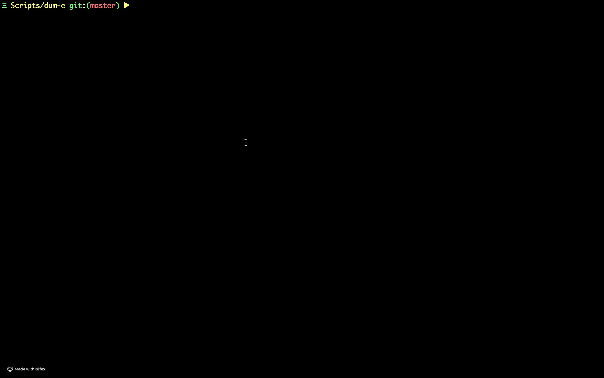

# Dum - E
Helper scripts - which is of use at times, and at times needed the most. just like stark's [dum-e](http://ironman.wikia.com/wiki/Dum-E_and_U).


## Installation
- if you're using ZSH clone the repository under $ZSH_CUSTOM directory
- or source the scripts in `~/.zshrc` or `~/.bashrc` file
```
git clone https://github.com/devdinu/dum-e $HOME/dum-e
echo  "for f in $HOME/dum-e/*.sh; do source $f; done" >> ~/.bashrc
```

## Usage

### Gitlab Scripts
set `GLTOKEN` the gitlab token for API access
- `clone_repos group_id`  - given id of group, downloads all the repos
- `clone_group_repos name` - given name of the group, downloads all the repos
- `get_group_info name` - given name of repo, show group info, can find id from here

##### Requirements
* [Jq](https://stedolan.github.io/jq/) JSON processor tool

### Golang
- Hot reload: rebuild and run the services on any `*.go` files
- `grlod` which runs and does hot reload of the service, on any change of go files. script is applicable for bash shell (`$BASH` var should have been set),
running function in xargs/parallel `ZSH` is yet to be fixed.
- `fw | echo` - pass any command to run on a filechange in dir.

##### Requirements
* [fswatch](https://github.com/emcrisostomo/fswatch)  file change notifier

### Docker
- `docker_clean`: does cleanup, by removing images with tag `<none>` and runs `system prune` 

### Git
- `echo 'source git.sh' >> ~/.zshrc` to add the command
- `pull_repos` finds all git directories in PWD recursively and pull the repos in parallel


### Docker, Kubernetes
- `k` alias to kubectl
- `docker_clean` removes dangling images, and does sytem prune (container, network)



### Miscellaneous
- `wifirestart` - restarts wifi, using networksetup supported in Darwin
